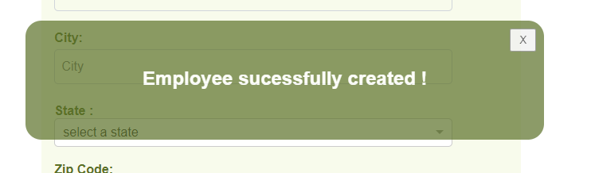

# React Modal Component

## Description
A simple and reusable Modal component for React.

## Installation

Run the following command : 
npm i @rayhearth/react_modal

## Configuration
The component needs two props :

{message} : write here the message you want to display in the modal.

{close} : to close the modal. You will have to add a closing function in your file.

## Compatibility

This component has been developped with the current latest version of React (v18.2.0).